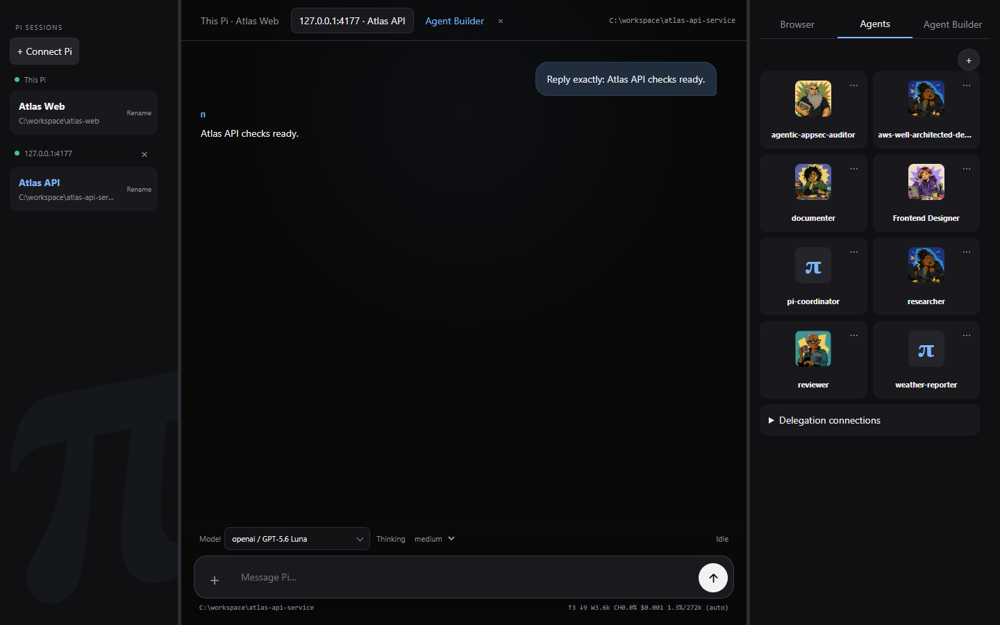
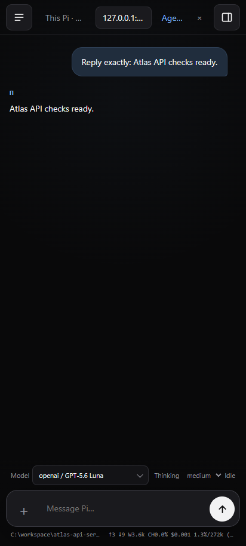
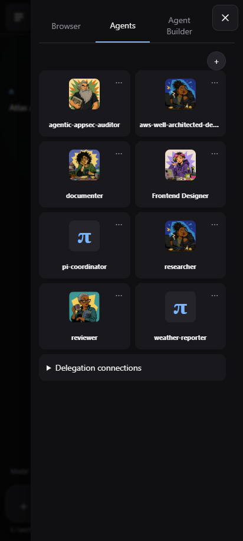
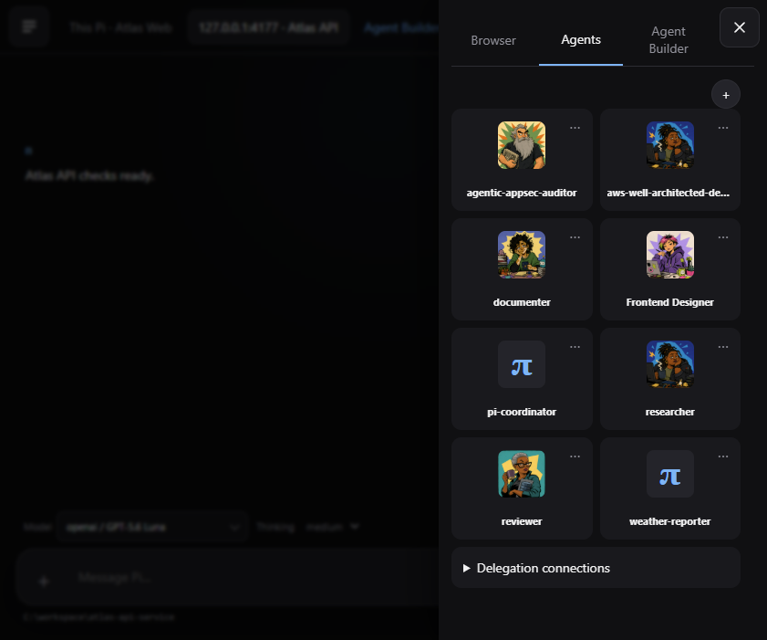

<p align="center">
  <a href="https://pi.dev">
    
  </a>
</p>

# Pi Agents

Pi Agents is a developer-focused fork of [earendil-works/pi](https://github.com/earendil-works/pi). It preserves Pi's CLI, agent runtime, multi-provider model support, and extension system while adding an authenticated local web workspace for running Pi sessions, deployed agents, browser automation, and coordinated workflows together.



## What this fork adds

| Area | Added behavior |
|---|---|
| Web console | `pi --serve` launches a token-protected, responsive workspace with session tabs, model controls, usage telemetry, attachments, prompt history, and resizable panels. |
| Multiple Pi sessions | Connect independent Pi processes and project directories in one console. Each process keeps its own model, transcript, tools, working directory, and stop state. |
| Persistent agents | Create persona-backed agents with a project root, model, thinking level, executor, filesystem policy, browser policy, and explicit tool grants. Chat and run history survive restarts. |
| Agent Builder | Build or edit an agent through a temporary chat tab while structured Profile, Runtime, Capabilities, Delegation, and Automation settings remain available in the side workspace. |
| Deployment Settings | A gear beside Sessions opens project-scoped Models, Connections, Capabilities, Plugins & MCP, and Security settings without replacing the active chat. |
| Orchestration | Run sequential, parallel, and supervisor workflows. `pi-coordinator` executes dependency-aware work packages and exposes inspectable subagent progress without flooding the main chat. |
| Routines | Define cron-backed agent or workflow runs with persisted schedules, results, artifacts, retries, and restart recovery. |
| Managed browser | Pi and permitted agents can open local or remote pages in managed Chromium, inspect and operate them, share control with the user, record walkthroughs, and pop out the live view. |
| Portable browser workflows | Compile recorded walkthroughs into versioned semantic automation, validate them in a fresh browser, and assign exact active versions to Pi, agents, skills, routines, larger workflows, or frontend tests with persistent run evidence. |
| Connections | Delegate tasks through model-selectable Claude Code, OpenAI, and Hermes connections; manage plugins, MCP servers, API endpoints, and per-agent capability grants. |
| Capability broker | Review and enable canonical providers, bind agent grants to revocable secret-reference accounts, run weather/feed/site monitors, require target-bound receipts for external writes, and route signed inbound messages to a fixed Pi session or agent. |
| Interoperability | Expose selected agents through an authenticated A2A 1.0 HTTP+JSON boundary using the same persistent task service as local chat and workflows. |
| Responsive access | Phone and unfolded Pixel Fold layouts keep chat primary and open Sessions or Browser/Agents/Agent Builder as dismissible side panels. |

<table>
  <tr>
    <td></td>
    <td></td>
    <td></td>
  </tr>
  <tr>
    <td align="center">Mobile chat</td>
    <td align="center">Mobile agents</td>
    <td align="center">Unfolded Pixel Fold</td>
  </tr>
</table>

## Start the web workspace

Run Pi from the project it should operate on:

```sh
cd path/to/project
pi --serve
```

Pi starts at port `4173` and selects the next available port when needed. It prints a process-scoped capability URL containing the authentication token. Open that exact URL in a browser.

To run several projects, start one Pi process in each directory. Then use **Connect Pi** in any console and enter the complete capability URL printed by another process. The console can switch among those sessions while every Pi process and deployed agent continues independently.

See [pi-Agents local console](docs/pi-agents-serve.md) for storage, executors, companion extensions, and focused verification commands.

## Local network access

Bind explicitly to the machine's network interfaces:

```sh
pi --serve --serve-host 0.0.0.0
```

Open the printed port from another device using the machine's LAN address:

```text
http://192.168.x.x:<port>/?token=<printed-token>
```

The token is a bearer capability: anyone who has the complete URL can control that Pi process with the permissions of the account that launched it. Use a trusted LAN, host firewall, or authenticated reverse proxy/VPN. Do not publish the URL or expose the port directly to the public Internet.

## Agent and workflow model

Pi remains the user-facing supervisor:

- Pi handles ordinary work directly.
- One bounded task can be delegated directly to one agent.
- Large or explicitly multi-agent work is written as a durable specification and sent to `pi-coordinator`.
- The coordinator chooses sequential or parallel execution from declared dependencies, bounds concurrency and delegation depth, and returns consolidated evidence.
- Agent transcripts and private memory are not implicitly shared. Handoffs use explicit context, results, and validated artifact references.

Agent chat, Pi delegation, routines, workflows, and A2A requests all use the same persisted task lifecycle. See the [agent workspace and orchestration specification](docs/pi-agent-workspace-spec.md), [managed-browser specification](docs/pi-browser-preview-spec.md), and [portable browser workflow specification](docs/pi-browser-workflow-spec.md).

The reviewed extension, canonical capability, connection, approval, monitoring,
and inbound-routing layers are defined in the
[capability platform specification](docs/pi-capability-platform-spec.md).
Settings exposes provider accounts and health, deployment capability defaults,
approval history, fixed inbound routes, site monitors, and finance watchlists.
Agent Builder consumes those configured resources and grants only the selected
accounts and capabilities to each agent. All definitions persist across
`pi --serve` restarts.
Productivity provider cards remain unavailable until their reviewed connector
tools and account authorization are configured; raw consequential tools do not
bypass the broker's receipt requirement.

Set `SEARXNG_BASE_URL` in `.env.local` to the root URL of a trusted SearXNG
instance. `pi --serve` then registers `searxng_search`; review and enable the
SearXNG provider under Settings > Capabilities before
granting `web.search` to an agent. Firecrawl remains the escalation path for
scraping and bounded crawling.

## Security boundary

The web token authenticates the console; it is not an operating-system sandbox. Deployed agents run in separate child processes with isolated queues and working directories. Child environments exclude provider, OAuth, and API-key secrets; harness filesystem actions are path-confined and mediated by the host. The launching operating-system account remains the ultimate local authority, so use the documented container or sandbox patterns when stronger isolation is required.

## Upstream Pi

This fork tracks the upstream Pi project and retains its package structure and MIT license.

<p>
  <a href="https://discord.com/invite/3cU7Bz4UPx"></a>
  <a href="https://www.npmjs.com/package/@earendil-works/pi-coding-agent"></a>
</p>

- [Pi website](https://pi.dev)
- [Pi documentation](https://pi.dev/docs/latest)
- [Upstream repository](https://github.com/earendil-works/pi)

> Upstream contribution rules remain documented in [CONTRIBUTING.md](CONTRIBUTING.md). Fork-specific changes should be proposed against this repository.

## All Packages

| Package | Description |
|---------|-------------|
| **[@earendil-works/pi-telemetry](packages/telemetry)** | Vendor-neutral telemetry contracts, reference adapter, conformance tests, and typed schemas |
| **[@earendil-works/pi-ai](packages/ai)** | Unified multi-provider LLM API (OpenAI, Anthropic, Google, etc.) |
| **[@earendil-works/pi-agent-core](packages/agent)** | Agent runtime with tool calling and state management |
| **[@earendil-works/pi-coding-agent](packages/coding-agent)** | Interactive coding agent CLI |
| **[@earendil-works/pi-tui](packages/tui)** | Terminal UI library with differential rendering |

For Slack/chat automation and workflows see [earendil-works/pi-chat](https://github.com/earendil-works/pi-chat).

## Permissions & Containerization

Pi does not include a built-in permission system for restricting filesystem, process, network, or credential access. By default, it runs with the permissions of the user and process that launched it.

If you need stronger boundaries, containerize or sandbox Pi. See [packages/coding-agent/docs/containerization.md](packages/coding-agent/docs/containerization.md) for three patterns:

- **Gondolin extension**: keep `pi` and provider auth on the host while routing built-in tools and `!` commands into a local Linux micro-VM.
- **Plain Docker**: run the whole `pi` process in a local container for simple isolation.
- **OpenShell**: run the whole `pi` process in a policy-controlled sandbox.

## Contributing

See [CONTRIBUTING.md](CONTRIBUTING.md) for contribution guidelines and [AGENTS.md](AGENTS.md) for project-specific rules (for both humans and agents).  Longer term plans for Pi can also be found in [RFCs](https://rfc.earendil.com/keyword/pi/).

## Development

```bash
npm install --ignore-scripts  # Install all dependencies without running lifecycle scripts
npm run build         # Refresh model data, then build all packages
npm run build:offline # Rebuild using existing model data without network access
npm run check         # Lint, format, and type check
./test.sh            # Run tests (skips LLM-dependent tests without API keys)
./pi-test.sh         # Run pi from sources (can be run from any directory)
```

## Building standalone binaries from release source

GitHub releases include a versioned source archive covered by the release's `SHA256SUMS` file. Extract it and run the same build script used for the official standalone binaries:

```bash
VERSION="<release-version>"
tar -xzf "pi-${VERSION}-source.tar.gz"
cd "pi-${VERSION}"
./scripts/build-binaries.sh --offline-model-data --platform linux-x64 --out "$PWD/out"
```

The source archive includes the generated provider model data used for the release. `--offline-model-data` builds with that snapshot instead of refreshing it from live provider catalogs. The script still installs dependencies, builds the monorepo, compiles the Bun executable, and stages its runtime assets. Package maintainers who provide dependencies separately can pass `--skip-install --skip-deps`.

## Supply-chain hardening

We treat npm dependency changes as reviewed code changes.

- Direct external dependencies are pinned to exact versions. Internal workspace packages remain version-ranged.
- `.npmrc` sets `save-exact=true` and `min-release-age=2` to avoid same-day dependency releases during npm resolution.
- `package-lock.json` is the dependency ground truth. Pre-commit blocks accidental lockfile commits unless `PI_ALLOW_LOCKFILE_CHANGE=1` is set.
- `npm run check` verifies pinned direct deps, native TypeScript import compatibility, and the generated coding-agent shrinkwrap.
- The published CLI package includes `packages/coding-agent/npm-shrinkwrap.json`, generated from the root lockfile, to pin transitive deps for npm users.
- Release smoke tests use `npm run release:local` to build, pack, and create isolated npm and Bun installs outside the repo before tagging a release.
- Local release installs, documented npm installs, and `pi update --self` use `--ignore-scripts` where supported.
- CI installs with `npm ci --ignore-scripts`, and a scheduled GitHub workflow runs `npm audit --omit=dev` plus `npm audit signatures --omit=dev`.
- Shrinkwrap generation has an explicit allowlist for dependency lifecycle scripts; new lifecycle-script deps fail checks until reviewed.

## Share your OSS coding agent sessions

If you use Pi or other coding agents for open source work, please share your sessions.

Public OSS session data helps improve coding agents with real-world tasks, tool use, failures, and fixes instead of toy benchmarks.

For the full explanation, see [this post on X](https://x.com/badlogicgames/status/2037811643774652911).

To publish sessions, use [`badlogic/pi-share-hf`](https://github.com/badlogic/pi-share-hf). Read its README.md for setup instructions. All you need is a Hugging Face account, the Hugging Face CLI, and `pi-share-hf`.

You can also watch [this video](https://x.com/badlogicgames/status/2041151967695634619), where I show how I publish my `pi-mono` sessions.

I regularly publish my own `pi-mono` work sessions here:

- [badlogicgames/pi-mono on Hugging Face](https://huggingface.co/datasets/badlogicgames/pi-mono)

## License

MIT

<p align="center">
  <a href="https://pi.dev">pi.dev</a> domain graciously donated by
  <br /><br />
  <a href="https://exe.dev"><br />exe.dev</a>
</p>
