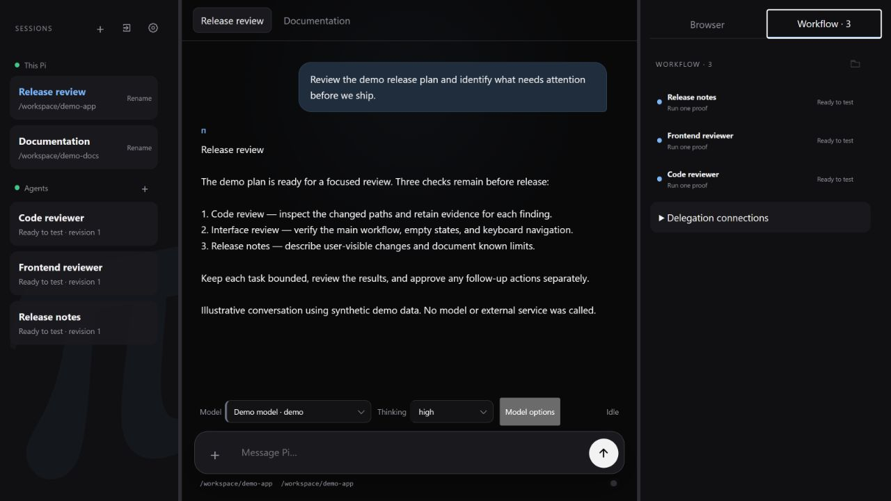
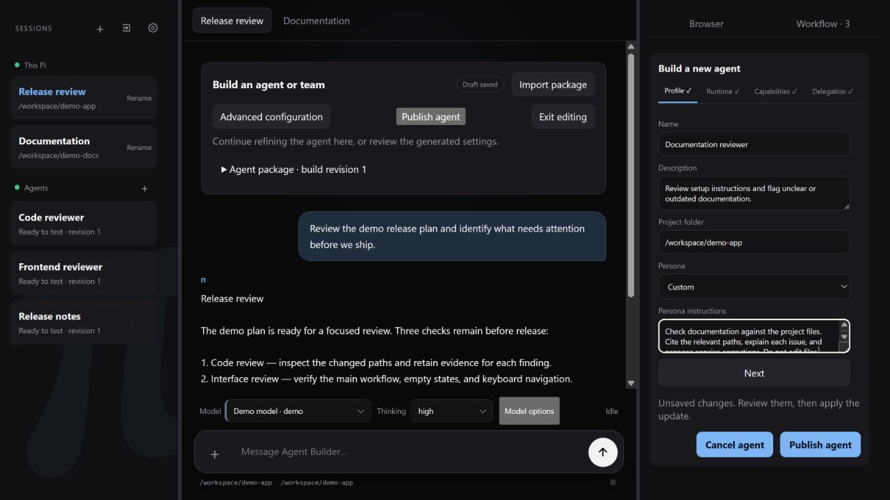

<p align="center">
  <a href="https://github.com/r33n3/pi-Agents">
    
  </a>
</p>

# Pi Agents

Pi Agents (ForkPI) is a developer-focused fork of [earendil-works/pi](https://github.com/earendil-works/pi). It builds on Pi's CLI, agent runtime, multi-provider model support, and extension system with an authenticated local web workspace for persistent agents, browser automation, and coordinated workflows.

Use it to manage coding sessions, configure reusable agents, review their work,
and run approved automation from one workspace. This is an independently maintained
fork; upstream package and release links do not distribute this fork's additions.

## Screenshots

The development interface below uses synthetic sessions, agents, and conversation
content. “Demo model” is a fixture, not a connected provider. No personal data or
live execution results are shown.

**Workspace:** session navigation, chat, model controls, and agent proof-review
items in one view.



<details>
<summary>Agent Builder: review a draft before publishing</summary>

Set the agent's purpose, project folder, and instructions in the Profile panel.
The example is a saved draft; it has not been published or run.



</details>

See [screenshot capture notes](docs/screenshots/README.md) for provenance and privacy checks.

## How this fork differs from upstream

| Area | Upstream Pi | Pi Agents |
|---|---|---|
| Foundation | Extensible coding CLI, agent runtime, and multi-provider APIs | Builds on those packages and retains the CLI and extension system |
| Workspace | Terminal-first coding workflow with SDK and extension integration | Adds the `pi --serve` browser console and deployment settings |
| Persistent agents | Building blocks for custom agent applications | Adds Agent Builder, saved definitions, task history, and proof review |
| Automation | Extensible through tools and extensions | Adds integrated workflows, routines, managed browsing, and recorded browser workflows |
| Controls | Runs with the launching account's permissions; supports external sandbox patterns | Adds capability grants, approval records, and scoped harness tools, subject to the limits below |

The fork's focus is workflow and operational control. More features do not by
themselves establish better coding accuracy; results still depend on the model,
tools, context, and task.

## Current scope and limits

The workspace is under active development and intended for trusted local use.
Review agent output before enabling unattended work. Current limits include:

- **Shared serve storage:** processes using the same agent directory share definitions, routines, and run records, but execution locks are local to each process. Starting another host can treat a live run as interrupted. Use one serve host per agent directory for deployed agents and routines.
- **Overlapping workspaces:** writer exclusion checks exact workspace paths. Do not run writers concurrently against a parent directory and its subdirectory, or different paths to the same directory.
- **Read-only session tools:** the `session` executor can still enable `bash` or `edit` with a read-only policy. For bounded file inspection, use the `harness` executor with only `read` and `list`; use OS isolation when a stronger boundary is required.
- **Run budgets:** cumulative token and cost limits are checked after execution. They are not hard spending caps across a multi-turn run.

See [Security boundary](#security-boundary) before granting tools or exposing a listener.

## What this fork adds

| Area | Added behavior |
|---|---|
| Web console | `pi --serve` launches a token-protected, responsive workspace with session tabs, model controls, usage telemetry, attachments, prompt history, and resizable panels. |
| Multiple Pi sessions | Connect Pi processes and project directories in one console. Each live session keeps its own model, transcript, tools, working directory, and stop state; deployed-agent storage has the sharing limits above. |
| Persistent agents | Create persona-backed agents with a project root, model, thinking level, executor, filesystem policy, browser policy, and explicit tool grants. Chat and run history survive restarts. |
| Agent Builder | Build or edit an agent through a temporary chat tab while structured Profile, Runtime, Capabilities, Delegation, and Automation settings remain available in the side workspace. |
| Proof review | Stage a draft or candidate revision, explicitly publish it, run a proof task, and review retained evidence before promotion and schedule activation. |
| Deployment Settings | A gear beside Sessions opens project-scoped Models, Connections, Capabilities, Plugins & MCP, and Security settings without replacing the active chat. |
| Orchestration | Run sequential, parallel, and supervisor workflows. `pi-coordinator` executes dependency-aware work packages and exposes inspectable subagent progress without flooding the main chat. |
| Routines | Define cron-backed agent or workflow runs with persisted schedules, results, artifacts, retries, and restart recovery. |
| Managed browser | Pi and permitted agents can open local or remote pages in managed Chromium, inspect and operate them, share control with the user, record walkthroughs, and pop out the live view. |
| Portable browser workflows | Compile recorded walkthroughs into versioned semantic automation, validate them in a fresh browser, and assign exact active versions to Pi, agents, skills, routines, larger workflows, or frontend tests with persistent run evidence. |
| Connections | Delegate tasks through model-selectable Claude Code, OpenAI, and Hermes connections; manage plugins, MCP servers, API endpoints, and per-agent capability grants. |
| Capability broker | Review and enable canonical providers, bind agent grants to revocable secret-reference accounts, run weather/feed/site monitors, require target-bound receipts for external writes, and route signed inbound messages to a fixed Pi session or agent. |
| Interoperability | Expose selected agents through an authenticated A2A 1.0 HTTP+JSON boundary using the same persistent task service as local chat and workflows. |
| Responsive access | Phone and unfolded Pixel Fold layouts keep chat primary and open Sessions or Browser/Agents/Agent Builder as dismissible side panels. |

## Start the web workspace

Build this repository to use the fork. Installing the upstream
`@earendil-works/pi-coding-agent` package does not install the web workspace described here.

Requires Git, Node.js 22.19.0 or later, and npm. From a terminal:

```sh
git clone https://github.com/r33n3/pi-Agents.git
cd pi-Agents
npm ci --ignore-scripts
npm run build
```

Start from the checkout on Linux or macOS:

```sh
./pi-test.sh --serve
```

Or in Windows PowerShell:

```powershell
.\pi-test.ps1 --serve
```

Configure a model provider before submitting a task. See the
[coding-agent guide](packages/coding-agent/README.md) for provider authentication.
For managed browser automation, install Chromium with
`./pi-test.sh browser install chromium` or `.\pi-test.ps1 browser install chromium`.

If your `pi` command already points to a build of this fork, run it from the
project it should operate on:

```sh
cd path/to/project
pi --serve
```

Pi binds to `127.0.0.1`, starts at port `4173`, and selects the next available port when needed. It prints a capability URL containing the authentication token. Open that exact URL in a browser. The token is generated for the process unless you explicitly configure `PI_SERVE_TOKEN`.

Use **Connect Pi** to attach another running Pi process by its complete capability
URL. Switching the visible session does not stop the other process. This does not
isolate shared agent storage: follow the single-host guidance above when using
deployed agents or routines.

See [pi-Agents local console](docs/pi-agents-serve.md) for storage, executors, companion extensions, and focused verification commands.

## Keep user data private

Agents, drafts, sessions, credentials, and generated evidence are local user data,
not contributions to this repository. The root `.gitignore` keeps `.pi/` private
by default, with explicit exceptions only for reviewed source shipped here.
Put personal build workspaces under `.local/` or outside the checkout. Store
screenshots and reports under `output/`; public examples must use synthetic data.

See [user-data privacy and reusable ignore rules](docs/pi-user-data-privacy.md)
before testing, contributing, or sharing an agent. Ignore rules do not protect
already tracked files or remove data from Git history.

## Local network access

Bind explicitly to the machine's network interfaces:

```sh
pi --serve --serve-host 0.0.0.0
```

Open the printed port from another device using the machine's LAN address:

```text
http://192.168.x.x:<port>/?token=<printed-token>
```

The token is a bearer capability: anyone who has the complete URL can control that Pi process with the permissions of the account that launched it. Use a trusted LAN, host firewall, or authenticated reverse proxy/VPN. Do not publish the URL or expose the port directly to the public Internet.

## Agent and workflow model

Pi remains the user-facing supervisor:

- Pi handles ordinary work directly.
- One bounded task can be delegated directly to one agent.
- Large or explicitly multi-agent work is written as a durable specification and sent to `pi-coordinator`.
- The coordinator chooses sequential or parallel execution from declared dependencies, bounds concurrency and delegation depth, and returns consolidated evidence.
- Agent transcripts and private memory are not implicitly shared. Handoffs use explicit context, results, and validated artifact references.

Agent chat, Pi delegation, routines, workflows, and A2A requests all use the same persisted task lifecycle. See the [agent workspace and orchestration specification](docs/pi-agent-workspace-spec.md), [managed-browser specification](docs/pi-browser-preview-spec.md), and [portable browser workflow specification](docs/pi-browser-workflow-spec.md).

The reviewed extension, canonical capability, connection, approval, monitoring,
and inbound-routing layers are defined in the
[capability platform specification](docs/pi-capability-platform-spec.md).
Settings exposes provider accounts and health, deployment capability defaults,
approval history, fixed inbound routes, site monitors, and finance watchlists.
Agent Builder consumes those configured resources and grants only the selected
accounts and capabilities to each agent. All definitions persist across
`pi --serve` restarts.
Productivity provider cards remain unavailable until their reviewed connector
tools and account authorization are configured; raw consequential tools do not
bypass the broker's receipt requirement.

Set `SEARXNG_BASE_URL` in `.env.local` to the root URL of a trusted SearXNG
instance. `pi --serve` then registers `searxng_search`; review and enable the
SearXNG provider under Settings > Capabilities before
granting `web.search` to an agent. Firecrawl remains the escalation path for
scraping and bounded crawling.

## Security boundary

The web token grants control of the Pi process to its holder. It does not provide
per-user roles or an operating-system sandbox. Keep the listener local unless you
have configured the network protections described above.

Deployed task runs use separate child processes. Worker environments filter
inherited credentials; the selected model credential can still be supplied over
private process messaging. Harness filesystem tools are path-confined and
mediated by the host. Standard session tools and installed extensions run with
the launching account's authority. Neither a child process nor a tool grant
provides an OS boundary against untrusted code.

Use the [container and sandbox patterns](packages/coding-agent/docs/containerization.md)
when stronger isolation is required. The concurrency, read-only, and budget
limits above also apply to unattended work.

## Upstream Pi

This fork follows the upstream Pi project and retains its package structure and
MIT license. The links and npm badge below describe upstream Pi, not a Pi Agents
release. Fork-specific support and changes belong in
[r33n3/pi-Agents](https://github.com/r33n3/pi-Agents).

<p>
  <a href="https://discord.com/invite/3cU7Bz4UPx"></a>
  <a href="https://www.npmjs.com/package/@earendil-works/pi-coding-agent"></a>
</p>

- [Pi website](https://pi.dev)
- [Pi documentation](https://pi.dev/docs/latest)
- [Upstream repository](https://github.com/earendil-works/pi)

> Upstream contribution rules remain documented in [CONTRIBUTING.md](CONTRIBUTING.md). Fork-specific changes should be proposed against this repository.

## All Packages

| Package | Description |
|---------|-------------|
| **[@earendil-works/pi-telemetry](packages/telemetry)** | Vendor-neutral telemetry contracts, reference adapter, conformance tests, and typed schemas |
| **[@earendil-works/pi-ai](packages/ai)** | Unified multi-provider LLM API (OpenAI, Anthropic, Google, etc.) |
| **[@earendil-works/pi-agent-core](packages/agent)** | Agent runtime with tool calling and state management |
| **[@earendil-works/pi-coding-agent](packages/coding-agent)** | Interactive coding agent CLI |
| **[@earendil-works/pi-tui](packages/tui)** | Terminal UI library with differential rendering |

For Slack/chat automation and workflows see [earendil-works/pi-chat](https://github.com/earendil-works/pi-chat).

## Permissions & Containerization

Pi Agents adds application-level tool policies and capability approvals, but it
does not include an OS sandbox for restricting process, network, or credential
access. It runs with the permissions of the user and process that launched it.

If you need stronger boundaries, containerize or sandbox Pi. See [packages/coding-agent/docs/containerization.md](packages/coding-agent/docs/containerization.md) for three patterns:

- **Gondolin extension**: keep `pi` and provider auth on the host while routing built-in tools and `!` commands into a local Linux micro-VM.
- **Plain Docker**: run the whole `pi` process in a local container for simple isolation.
- **OpenShell**: run the whole `pi` process in a policy-controlled sandbox.

## Contributing

Propose fork-specific changes against [r33n3/pi-Agents](https://github.com/r33n3/pi-Agents).
Follow [AGENTS.md](AGENTS.md) for development rules and
[user-data privacy guidance](docs/pi-user-data-privacy.md) before sharing files.
[CONTRIBUTING.md](CONTRIBUTING.md) documents the upstream contribution gate;
read it before submitting work upstream. Upstream plans are discussed in
[Pi RFCs](https://rfc.earendil.com/keyword/pi/).

## Development

```bash
npm install --ignore-scripts  # Install all dependencies without running lifecycle scripts
npm run build         # Refresh model data, then build all packages
npm run build:offline # Rebuild using existing model data without network access
npm run check         # Lint, format, and type check
./test.sh            # Run tests (skips LLM-dependent tests without API keys)
./pi-test.sh         # Run pi from sources (can be run from any directory)
```

## Building standalone binaries from release source

Upstream GitHub releases include a versioned source archive covered by the
release's `SHA256SUMS` file. Those archives build upstream Pi, not this fork.
For an upstream release, extract the archive and run its binary build script:

```bash
VERSION="<release-version>"
tar -xzf "pi-${VERSION}-source.tar.gz"
cd "pi-${VERSION}"
./scripts/build-binaries.sh --offline-model-data --platform linux-x64 --out "$PWD/out"
```

The source archive includes the generated provider model data used for the release. `--offline-model-data` builds with that snapshot instead of refreshing it from live provider catalogs. The script still installs dependencies, builds the monorepo, compiles the Bun executable, and stages its runtime assets. Package maintainers who provide dependencies separately can pass `--skip-install --skip-deps`.

## Supply-chain hardening

We treat npm dependency changes as reviewed code changes.

- Direct external dependencies are pinned to exact versions. Internal workspace packages remain version-ranged.
- `.npmrc` sets `save-exact=true` and `min-release-age=2` to avoid same-day dependency releases during npm resolution.
- `package-lock.json` is the dependency ground truth. Pre-commit blocks accidental lockfile commits unless `PI_ALLOW_LOCKFILE_CHANGE=1` is set.
- `npm run check` verifies pinned direct deps, native TypeScript import compatibility, and the generated coding-agent shrinkwrap.
- The published CLI package includes `packages/coding-agent/npm-shrinkwrap.json`, generated from the root lockfile, to pin transitive deps for npm users.
- Release smoke tests use `npm run release:local` to build, pack, and create isolated npm and Bun installs outside the repo before tagging a release.
- Local release installs, documented npm installs, and `pi update --self` use `--ignore-scripts` where supported.
- CI installs with `npm ci --ignore-scripts`, and a scheduled GitHub workflow runs `npm audit --omit=dev` plus `npm audit signatures --omit=dev`.
- Shrinkwrap generation has an explicit allowlist for dependency lifecycle scripts; new lifecycle-script deps fail checks until reviewed.

## Share your OSS coding agent sessions

If you use Pi or other coding agents for open source work, please share your sessions.

Sharing is optional and requires a separate review and explicit publication.
Never include private agent packages, credentials, capability URLs, personal
conversations, or user data. The ignore rules do not sanitize session exports.

Public OSS session data helps improve coding agents with real-world tasks, tool use, failures, and fixes instead of toy benchmarks.

For the full explanation, see [this post on X](https://x.com/badlogicgames/status/2037811643774652911).

To publish sessions, use [`badlogic/pi-share-hf`](https://github.com/badlogic/pi-share-hf). Read its README.md for setup instructions. All you need is a Hugging Face account, the Hugging Face CLI, and `pi-share-hf`.

The upstream maintainer demonstrates session publication in
[this video](https://x.com/badlogicgames/status/2041151967695634619).

The upstream maintainer's published `pi-mono` sessions are available here:

- [badlogicgames/pi-mono on Hugging Face](https://huggingface.co/datasets/badlogicgames/pi-mono)

## License

MIT

<p align="center">
  Upstream <a href="https://pi.dev">pi.dev</a> domain donated by
  <br /><br />
  <a href="https://exe.dev"><br />exe.dev</a>
</p>
